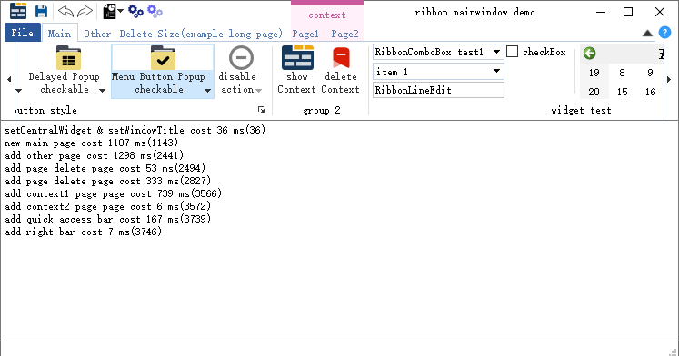

# 前言

<div align="left">&nbsp;&nbsp;&nbsp;&nbsp;<font size=8>QxRibbon</font></div>

QxRibbon 是一款 Microsoft Ribbon for Qt 组件，最初是基于 SARibbon 演变而来，同时，也参考借鉴了 QtitanRibbon、BCGControls 等诸多 ribbon 风格组件的优秀功能/想法。

# 命名

关于 QxRibbon 名字的由来，先抱怨一下，起名字真是一件伤脑筋的事……

最初，仓库名叫 qtribbon，类名以 QRibbon 作为前缀。是的，大言不惭的参考了 Qt 源代码的命名方式，有一种 Qt 出品的感脚。后来，写着写着，发现能力不行、代码太烂，还是重新起个名字吧。。

于是，以 A-Z 这 26 个字母依次加到 Ribbon 前面看哪个更好看、更有意义，如下一些名字差点入选：
- CRibbon：C 是 Class 的首字母，符合 Windows C++ 编程风格
- JRibbon：J 是 Jie 的首字母，但又有点 Jave 的意味
- KRibbon：K 是 KDE 的自字母，容易被认为是 KDE 出品
- MRibbon：M 是 Ma，My，Microsoft 的首字母，MyRibbon 可以类比于 MySQL
- XRibbon：X 代表无限

以上落选还有一点原因就是：体现不出 for Qt

我们知道，Qt 官方不支持 Ribbon 风格（Ribbon UI 风格是微软开创的，具有专利许可协议，许可协议对从构建 UI 的指令到每个按钮间的空格数都做了详细的规定。接受该协议的开发人员，必须同意严格遵循当前和未来的设计指南，并且不能用其开发与 MS Office 直接竞争的产品。据说微软已停用了协议授权，当前在未经授权的情况下，开发和使用 Ribbon 风格控件算不算侵权，存疑。。）

for Qt 像是 Qt + X（X 代表 Qt 没有的）的意思，想到这，那就叫 Q+Ribbon 吧……

好了，+ 肯定不行，那就改乘(x)吧（+旋转45°），于是就叫 QxRibbon，这样以后说不定还能做成一个系列，即 Qt x Others


# 现状

目前，市面上关于 Ribbon for Qt 的项目，有开源的，也有商用的，数量不在少数，下面罗列一些：

- [QtitanRibbon](https://www.devmachines.com/qtitanribbon-overview.html)：一款商用的遵循 Microsoft Ribbon UI 的组件，功能高级
- [SARibbon](https://gitee.com/czyt1988/SARibbon)：一款轻量级的 Ribbon 控件，功能中级
- [fancyribbon](https://gitee.com/icanpool/qtcanpool/tree/master/demos/fancyribbon)：一款精选的 Ribbon 控件，功能初级
- [QtRibbonGUI](https://github.com/liang1057/QtRibbonGUI)：一款简单的 Ribbon-UI，功能初级
- [QRibbon](https://github.com/gnibuoz/QRibbon)：标准 QMenuBar 自动转换为 Ribbon 风格，思路不错，功能初级
- [Qt-Ribbon-Widget](https://github.com/martijnkoopman/Qt-Ribbon-Widget)：A Ribbon widget for Qt，功能初级
- [TabToolbar](https://github.com/SeriousAlexej/TabToolbar)：A small library for creating tabbed toolbars，功能初级
- [CbersUI](https://github.com/longhuan2018/CbersUI)：QT Ribbon Plugin Framework，功能未知
- [qt-ribbon](https://github.com/nedrysoft/qt-ribbon)：A ribbon bar implementation for Qt widgets applications，功能未知
- [wribbon](https://github.com/wteamit/wribbon)：Qt Ribbon library，功能未知
- [stripemenu](https://github.com/remizero/stripemenu)：Menu tipo cinta basado en Qt ( Ribbon menu Qt-based )，功能未知
- [ribbon](https://github.com/weiwucs/ribbon)：SARibbon 衍生版本
- ...

微软的 Ribbon 命名空间：[System.Windows.Controls.Ribbon](https://learn.microsoft.com/zh-cn/dotnet/api/system.windows.controls.ribbon?view=windowsdesktop-8.0)

QxRibbon 组件中关键的类名与其它主流的命名区别如下：

|QxRibbon|QtitanRibbon|SARibbon|BCGControls|
|:---|:---|:---|:---|
|RibbonWindow|RibbonMainWindow|SARibbonMainWindow|N/A|
|RibbonBar|RibbonBar|SARibbonBar|CBCGPRibbonBar|
|RibbonPage|RibbonPage|SARibbonCategory|CBCGPRibbonCategory|
|RibbonGroup|RibbonGroup|SARibbonPanel|CBCGPRibbonPanel|
|RibbonGallery|RibbonGallery|SARibbonGallery|N/A|
|RibbonButton|RibbonButton|SARibbonToolButton|CBCGPRibbonButton|
|RibbonQuickAccessBar|RibbonQuickAccessBar|SARibbonQuickAccessBar|CBCGPRibbonQuickAccessToolbar|

备注：
- RibbonPage: 参考 QTabWidget 的 addTab(QWidget *page, const QString &label)，其中第一个参数取名 page

# 计划

- 形态：支持 QtWidgets、QtDesinger、QML/QtQuick、PyQt/PySide ...
- 平台：支持 Windows、MacOS（Quartz）、Linux（X11：GNOME/KDE/Unity/XFCE/LXDE/DDE...，Wayland：GNOME/KDE/Unity...）
- 构建：支持 qmake、cmake ...
- ...

具体支持情况：

**1）平台支持**

|平台|Windows|MacOS|Linux/X11|Linux/Wayland|
|:---|:---|:---|:---|:---|
|版本|10||||
|Qt5Widgets|√||||
|QtDesinger|||||
|Qt5Quick|||||
|PyQt5|||||
|PySide2|||||


**2）构建支持**

|构建方式|支持|版本|
|:---|:---|:---|
|qmake|√||
|cmake|||

**3）Qt 版本支持**

下面提供的支持是经过测试的，未提供的不代表不支持。

||Qt4|Qt5|Qt6|Qt7|
|:---|:---|:---|:---|:---|
|5.15.2||√|||

---

# 仓库
- github：[https://github.com/canpool/QxRibbon](https://github.com/canpool/QxRibbon)
- gitee：[https://gitee.com/icanpool/QxRibbon](https://gitee.com/icanpool/QxRibbon)


# 协议
* 遵循 [MIT](./LICENSE) 开源许可协议

# 规范
* [Google C++ Style Guide](http://google.github.io/styleguide/cppguide.html)
* [Qt 编程风格与规范](https://blog.csdn.net/qq_35488967/article/details/70055490)
* 源文件全英文的采用 UTF-8 编码，包含中文的采用 UTF-8 with BOM 编码
* 代码 git 提交格式：[git 知：提交格式](https://blog.csdn.net/canpool/article/details/126005367)

# 贡献
* 欢迎提交 issue 对关心的问题发起讨论
* 欢迎 Fork 仓库，pull request 贡献
* 贡献者可在文件头版权中添加个人信息，格式如下：
```
/**
 * Copyleft (C) YYYY NAME EMAIL
 * Copyleft (C) 2023 maminjie <canpool@163.com>
 * SPDX-License-Identifier: MIT
**/
```

# 交流
* QQ群：831617934（Qt业余交流）

# 演示
- <font size=4>mainwindow demo</font>



# 案例

虚位以待中……

# 后语

欢迎广大 Qt 开源爱好者加入其中，乐在其中……
